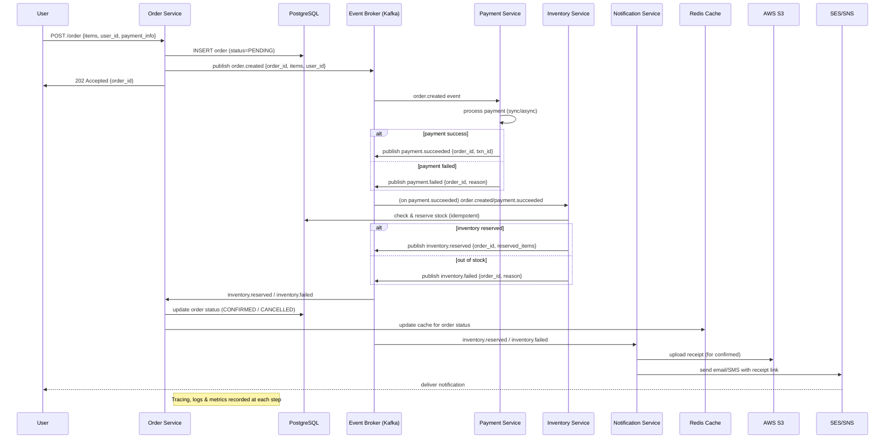

# FlowForge
Distributed Order Processing System

---

## Flow Overview

Order processing sequence 
1. Client -> Order Service
   - Client calls POST /order with items and user_id.
   - Order Service validates request.
   - Inserts order row in PostgreSQL with status = PENDING.
   - Publishes event: order.created { order_id, items, user_id } to Kafka.
   - Returns 202 Accepted.

2. Inventory Reservation
   - Inventory Service consumes order.created.
   - It checks available stock and performs an idempotent “reserve stock” operation.
   - If stock is available → publish inventory.reserved { order_id, reserved_items }
   - If stock is not available → publish inventory.failed { order_id, reason }

3. Order Status Update
   - Order Service consumes inventory.* events.
   - On inventory.reserved → update order.status = CONFIRMED in DB and update Redis cache.
   - On inventory.failed   → update order.status = CANCELLED and update Redis cache.

4. Notification
   - Notification Service consumes inventory.* events.
   - For confirmed orders:
       • Generate a receipt (HTML or PDF)
       • Upload it to S3 and generate a signed URL
       • Send email/SMS via SES/SNS with receipt link
   - For failed orders:
       • Send failure email/SMS

5. Observability & Reliability
   - All services write structured logs (JSON)
   - Traces propagate using OpenTelemetry trace IDs
   - Metrics exposed via Prometheus
   - Failed messages go to DLQ for inspection

---

## Sequence Diagram

### 🔁 Sequence Diagram (Order → Payment → Inventory → Notification)

---

## PLAN
📅 12-Day Development Plan

## 🗓️ 12-Day Development Plan

Below is the complete 12-day roadmap for the project.

---

### **Day 1 — Project Setup**
- [ ] Initialize repository (GitHub/GitLab)
- [ ] Create virtual environment & install dependencies
- [ ] Set up project folder structure
- [ ] Add initial README.md structure

---

### **Day 2 — Architecture Finalization**
- [ ] Define event-driven architecture
- [ ] Document major modules (producer, consumer, services)
- [ ] Finalize tech stack decisions (Kafka, FastAPI, PostgreSQL, etc.)

---

### **Day 3 — Order Service (API)**
- [ ] Build FastAPI service for order creation
- [ ] Validate incoming payloads
- [ ] Publish events to Kafka/Redis/RabbitMQ
- [ ] Add API documentation (Swagger/OpenAPI)

---

### **Day 4 — Event Producer Logic**
- [ ] Implement event model (OrderCreated event)
- [ ] Add message serialization (JSON/Avro)
- [ ] Implement retry & error handling

---

### **Day 5 — Event Consumer Setup**
- [ ] Build consumer service
- [ ] Subscribe to order-created events
- [ ] Add message processing loop

---

### **Day 6 — Payment Microservice**
- [ ] Create Payment Processor
- [ ] Simulate payment workflow
- [ ] Publish PaymentCompleted events

---

### **Day 7 — Inventory & Notification Services**
- [ ] Inventory microservice (check and decrement items)
- [ ] Notification service (email/SMS console simulation)
- [ ] Add event listeners for both

---

### **Day 8 — Database Integration**
- [ ] Add PostgreSQL/MySQL integration
- [ ] Save order, payment, and inventory logs
- [ ] Add migrations using Alembic

---

### **Day 9 — Orchestration & Workflow**
- [ ] Implement full event chain:
  - OrderCreated → PaymentCompleted → InventoryUpdated → NotificationSent
- [ ] Add status update mechanism

---

### **Day 10 — Logging & Monitoring**
- [ ] Add structured JSON logging
- [ ] Add metrics (Prometheus optional)
- [ ] Add central error handler

---

### **Day 11 — Testing**
- [ ] Write unit tests for each service
- [ ] Add integration tests for event flow
- [ ] Run load tests for order creation

---

### **Day 12 — Final Polishing**
- [ ] Improve README.md (architecture diagrams, instructions)
- [ ] Add Dockerfile(s) & docker-compose.yml
- [ ] Clean up structure & comments
- [ ] Prepare final demo

---

### Flow After Day 2

✅ Day 2 — Architecture Finalization (finalized)

Decisions made

Services (4 total):

order-service (FastAPI)

inventory-service (FastAPI)

notification-service (FastAPI)

(implicit) user-service is not separate — users table lives in Postgres and is managed by order-service (you may add a separate user service later if needed)

Messaging: Apache Kafka as event backbone for async communication between services. Services publish/consume events (no direct sync calls for the order→inventory→notification flow).

Database: PostgreSQL (central persistent store for orders, items, users, notifications).

Cache: Redis for hot reads: order status and item availability counts.

Local dev: Docker Compose (Kafka + Zookeeper + Postgres + Redis + services).

Production deploy: Kubernetes on AWS (EKS / kube objects, Services, Deployments, ConfigMaps, Secrets). Use managed Kafka (MSK or Confluent Cloud) or self-hosted in kube.

Service responsibilities & HTTP endpoints
Order Service (FastAPI)

GET /orders — get_all_orders (paginated)

POST /orders — post_place_order

Validates request, creates orders row with status=PENDING, writes to DB, publishes order.created event to Kafka, returns 202 Accepted with order_id.

GET /orders/user/{user_id} — get_orders_for_user

Notes:

Order service also consumes inventory events (inventory.reserved / inventory.failed) to update order status.

It caches order status in Redis for fast lookup.

Inventory Service (FastAPI)

GET /products/{id}/availability — get_availability_of_each_product

POST /products/availability — get_availabilities_of_list_of_products (accepts list of ids)

Kafka consumer: subscribes to order.created and performs reserve operation (updates items.available_count and emits inventory.reserved or inventory.failed). The update is done as part of a transaction to ensure correctness and idempotency.

(Optional admin API) POST /products/{id}/adjust — admin adjust inventory (not required, but useful)

Notes:

The inventory update that reacts to order.created should be performed by the Kafka consumer. You may expose HTTP endpoints for read and admin write; the event-driven update should be the canonical way inventory changes happen for orders.

Notification Service (FastAPI)

No mandatory public endpoints (optional health/metrics endpoints)

Kafka consumer: listens for inventory.reserved and inventory.failed. On reserved:

Generate order summary (receipt)

Upload receipt to S3

Send email/SMS via SES/SNS

Publish notification.sent event (optional)

Write notification row to notification table

Notes:

Notification service reads from Kafka and does not update order state; it only records notification activity.

Kafka topics & example event schemas (JSON)

Topics

order.created

inventory.reserved

inventory.failed

notification.sent (optional)

<topic>.dlq for each critical topic, e.g., order.created.dlq

Example: order.created

{
  "event_id": "uuid-v4",
  "event_type": "order.created",
  "timestamp": "2025-11-23T12:34:56Z",
  "order": {
    "order_id": "uuid-v4",
    "user_id": "uuid-v4",
    "items": [
      { "item_id": 101, "quantity": 2 },
      { "item_id": 205, "quantity": 1 }
    ],
    "total_amount": 59.99
  }
}

Example: inventory.reserved

{
  "event_id": "uuid-v4",
  "event_type": "inventory.reserved",
  "timestamp": "2025-11-23T12:35:00Z",
  "order_id": "uuid-v4",
  "reserved_items": [
    { "item_id": 101, "quantity": 2 },
    { "item_id": 205, "quantity": 1 }
  ]
}

Example: inventory.failed

{
  "event_id": "uuid-v4",
  "event_type": "inventory.failed",
  "timestamp": "2025-11-23T12:35:00Z",
  "order_id": "uuid-v4",
  "reason": "OUT_OF_STOCK",
  "failed_items": [ { "item_id": 101, "requested": 2, "available": 1 } ]
}

DLQ message shape: include original payload + error metadata (exception message, attempts).

Postgres schema (DDL — copy/paste ready)
-- users
CREATE TABLE IF NOT EXISTS users (
  id UUID PRIMARY KEY DEFAULT gen_random_uuid(),
  name TEXT NOT NULL,
  email TEXT UNIQUE NOT NULL,
  phone TEXT,
  password_hash TEXT NOT NULL,
  created_at TIMESTAMP WITH TIME ZONE DEFAULT now()
);

-- items
CREATE TABLE IF NOT EXISTS items (
  id SERIAL PRIMARY KEY,
  name TEXT NOT NULL,
  available_count INTEGER NOT NULL DEFAULT 0,
  created_at TIMESTAMP WITH TIME ZONE DEFAULT now(),
  updated_at TIMESTAMP WITH TIME ZONE DEFAULT now()
);

-- orders
CREATE TABLE IF NOT EXISTS orders (
  id UUID PRIMARY KEY DEFAULT gen_random_uuid(),
  user_id UUID NOT NULL REFERENCES users(id),
  status TEXT NOT NULL, -- e.g. PENDING, CONFIRMED, CANCELLED
  created_at TIMESTAMP WITH TIME ZONE DEFAULT now(),
  updated_at TIMESTAMP WITH TIME ZONE DEFAULT now()
);

-- order_items (normalize: one order can have many items)
CREATE TABLE IF NOT EXISTS order_items (
  id SERIAL PRIMARY KEY,
  order_id UUID NOT NULL REFERENCES orders(id) ON DELETE CASCADE,
  item_id INTEGER NOT NULL REFERENCES items(id),
  quantity INTEGER NOT NULL CHECK (quantity > 0),
  price NUMERIC(10,2),
  created_at TIMESTAMP WITH TIME ZONE DEFAULT now()
);

-- notifications
CREATE TABLE IF NOT EXISTS notifications (
  id UUID PRIMARY KEY DEFAULT gen_random_uuid(),
  user_id UUID NOT NULL REFERENCES users(id),
  type TEXT NOT NULL, -- 'email' or 'sms'
  order_id UUID,
  summary TEXT,
  status TEXT NOT NULL, -- SENT, FAILED, PENDING
  created_at TIMESTAMP WITH TIME ZONE DEFAULT now(),
  updated_at TIMESTAMP WITH TIME ZONE DEFAULT now()
);

-- idempotency table (optional but recommended)
CREATE TABLE IF NOT EXISTS processed_events (
  event_id UUID PRIMARY KEY,
  processed_at TIMESTAMP WITH TIME ZONE DEFAULT now()
);

Notes

I added a normalized order_items table (recommended vs a single orders row containing item blob). This is more flexible and standard.

Use processed_events table for idempotency checks (store event_id the first time it's handled).

Redis keys & caching strategy

Redis data

order_status:{order_id} → string (PENDING/CONFIRMED/CANCELLED) with TTL for cache freshness (e.g., 5–10 min)

item_avail:{item_id} → integer (available count) with short TTL or updated on inventory events

Optionally: user_orders:{user_id} → list of recent order_ids for fast per-user listing

Cache update rules

On DB write commit (e.g., order status update), update Redis immediately.

Redis is a cache only — canonical state is Postgres.

Idempotency & reliability (practical rules)

Include event_id in every event; consumers must check processed_events before applying side effects.

Consumer processing flow:

Deserialize message.

Check processed_events for event_id → if exists, ack/commit offset and skip.

Begin DB transaction.

Apply state changes (e.g., decrement items.available_count, insert reservation).

Insert processed_events(event_id).

Commit transaction.

Produce success event (e.g., inventory.reserved).

Commit/ack Kafka offset after successful DB commit and event production (or use outbox pattern).

If repeated transient errors occur, apply retry with exponential backoff then publish to DLQ after N attempts.

Deployment notes: Docker (local) vs Kubernetes (AWS EKS)

Local (Docker Compose)

Compose services: zookeeper, kafka, postgres, redis, jaeger, prometheus (optional), and the 3 FastAPI containers.

Local compose is for development + E2E testing. Keep volumes ephemeral for quick reset.

Production (Kubernetes on AWS)

Use EKS (managed Kubernetes) or another managed k8s cluster.

Deploy each service as a Deployment + Service (ClusterIP / LoadBalancer as needed).

Use ConfigMaps/Secrets for configuration (Kafka bootstrap servers, DB URL, AWS credentials).

Use a managed Kafka (MSK / Confluent Cloud) OR run Kafka cluster with persistent volumes in Kubernetes (more operational overhead).

For storage: RDS for Postgres (managed), ElastiCache for Redis, S3 for receipts.

Observability: Prometheus operator + Grafana, Fluentd/CloudWatch for logs, Jaeger for traces (or use X-Ray).

CI/CD: GitHub Actions build→push Docker image→apply k8s manifests (or use Helm charts / ArgoCD).

Checklist for Day 2 (copy/paste)
- [ ] Document final list of services (order, inventory, notification)
- [ ] Confirm endpoints for each service and which ones are HTTP vs event-driven
- [ ] Finalize Postgres schema (users, items, orders, order_items, notifications, processed_events)
- [ ] Define Redis key patterns and TTLs
- [ ] Define Kafka topics and event schemas
- [ ] Decide on idempotency strategy (processed_events table + event_id)
- [ ] Choose local vs prod infra (Docker Compose for local; Kubernetes/EKS for prod)
- [ ] Document DLQ and retry semantics