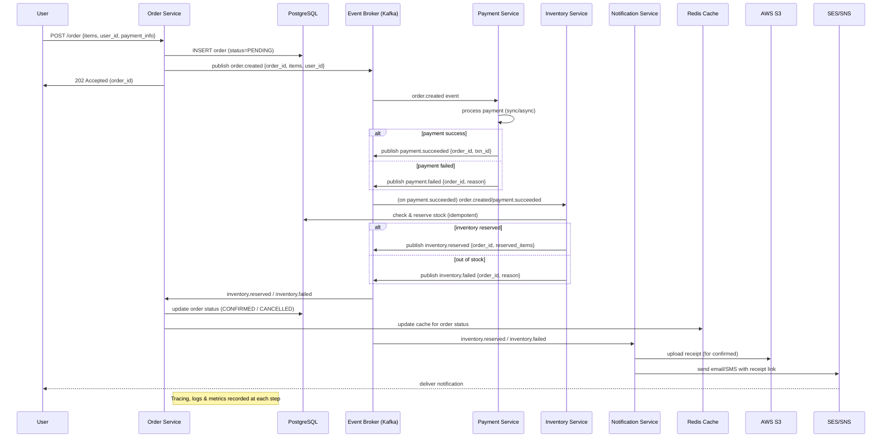

# FlowForge
Distributed Order Processing System

---

## Flow Overview

Order processing sequence 
1. Client -> Order Service
   - Client calls POST /order with items and user_id.
   - Order Service validates request.
   - Inserts order row in PostgreSQL with status = PENDING.
   - Publishes event: order.created { order_id, items, user_id } to Kafka.
   - Returns 202 Accepted.

2. Inventory Reservation
   - Inventory Service consumes order.created.
   - It checks available stock and performs an idempotent “reserve stock” operation.
   - If stock is available → publish inventory.reserved { order_id, reserved_items }
   - If stock is not available → publish inventory.failed { order_id, reason }

3. Order Status Update
   - Order Service consumes inventory.* events.
   - On inventory.reserved → update order.status = CONFIRMED in DB and update Redis cache.
   - On inventory.failed   → update order.status = CANCELLED and update Redis cache.

4. Notification
   - Notification Service consumes inventory.* events.
   - For confirmed orders:
       • Generate a receipt (HTML or PDF)
       • Upload it to S3 and generate a signed URL
       • Send email/SMS via SES/SNS with receipt link
   - For failed orders:
       • Send failure email/SMS

5. Observability & Reliability
   - All services write structured logs (JSON)
   - Traces propagate using OpenTelemetry trace IDs
   - Metrics exposed via Prometheus
   - Failed messages go to DLQ for inspection

---

## Sequence Diagram

### 🔁 Sequence Diagram (Order → Payment → Inventory → Notification)

---

## PLAN
📅 12-Day Development Plan

## 🗓️ 12-Day Development Plan

Below is the complete 12-day roadmap for the project.

---

### **Day 1 — Project Setup**
- [ ] Initialize repository (GitHub/GitLab)
- [ ] Create virtual environment & install dependencies
- [ ] Set up project folder structure
- [ ] Add initial README.md structure

---

### **Day 2 — Architecture Finalization**
- [ ] Define event-driven architecture
- [ ] Document major modules (producer, consumer, services)
- [ ] Finalize tech stack decisions (Kafka, FastAPI, PostgreSQL, etc.)

---

### **Day 3 — Order Service (API)**
- [ ] Build FastAPI service for order creation
- [ ] Validate incoming payloads
- [ ] Publish events to Kafka/Redis/RabbitMQ
- [ ] Add API documentation (Swagger/OpenAPI)

---

### **Day 4 — Event Producer Logic**
- [ ] Implement event model (OrderCreated event)
- [ ] Add message serialization (JSON/Avro)
- [ ] Implement retry & error handling

---

### **Day 5 — Event Consumer Setup**
- [ ] Build consumer service
- [ ] Subscribe to order-created events
- [ ] Add message processing loop

---

### **Day 6 — Payment Microservice**
- [ ] Create Payment Processor
- [ ] Simulate payment workflow
- [ ] Publish PaymentCompleted events

---

### **Day 7 — Inventory & Notification Services**
- [ ] Inventory microservice (check and decrement items)
- [ ] Notification service (email/SMS console simulation)
- [ ] Add event listeners for both

---

### **Day 8 — Database Integration**
- [ ] Add PostgreSQL/MySQL integration
- [ ] Save order, payment, and inventory logs
- [ ] Add migrations using Alembic

---

### **Day 9 — Orchestration & Workflow**
- [ ] Implement full event chain:
  - OrderCreated → PaymentCompleted → InventoryUpdated → NotificationSent
- [ ] Add status update mechanism

---

### **Day 10 — Logging & Monitoring**
- [ ] Add structured JSON logging
- [ ] Add metrics (Prometheus optional)
- [ ] Add central error handler

---

### **Day 11 — Testing**
- [ ] Write unit tests for each service
- [ ] Add integration tests for event flow
- [ ] Run load tests for order creation

---

### **Day 12 — Final Polishing**
- [ ] Improve README.md (architecture diagrams, instructions)
- [ ] Add Dockerfile(s) & docker-compose.yml
- [ ] Clean up structure & comments
- [ ] Prepare final demo

---

